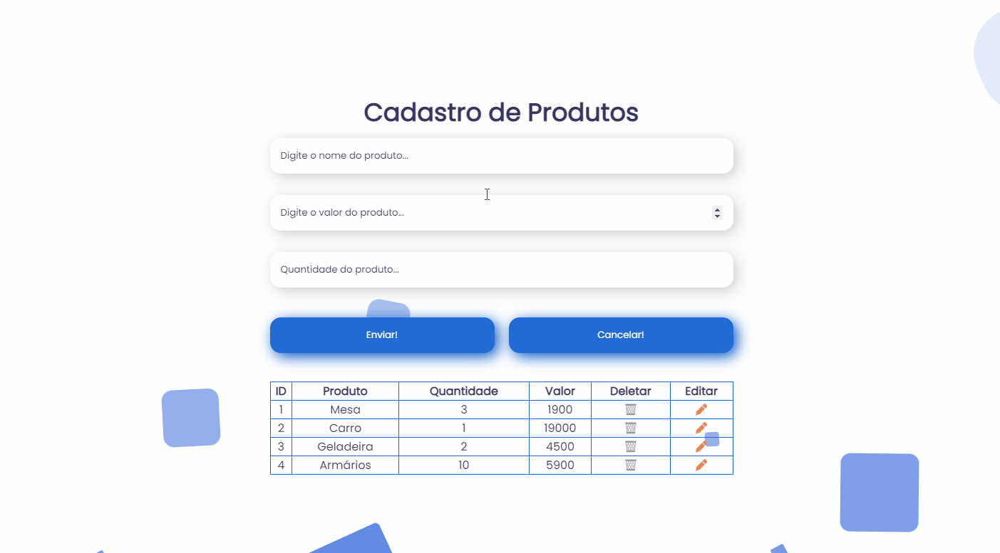
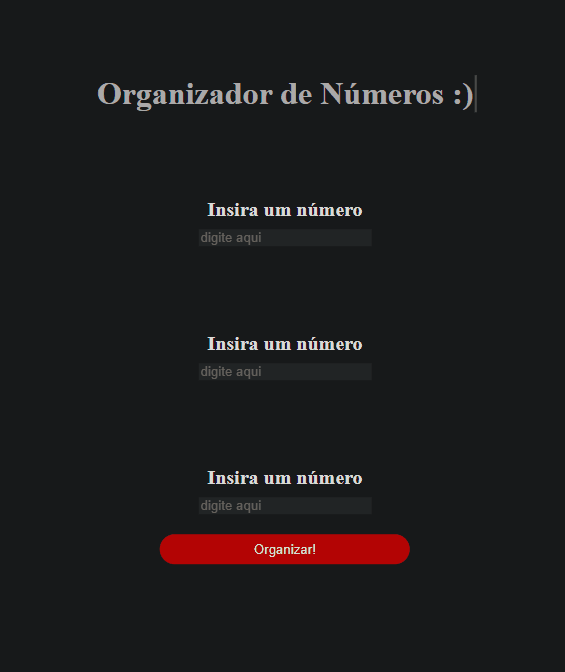

<<<<<<< HEAD
# product registration form | HTML + CSS + JAVASCRIPT

The product registration form was built using HTML, CSS and Javascript technologies. The project aims to register a product in a lookup table, in which you have the option to delete or edit the item.
 
 

## First Step
You can launch the application download and open it in any browser using LOCALHOST.
=======
# Numerical Organizer | Organizador Numérico

The Numerical Organizer has as its principle, to organize the numbers in an ascending way. The project only accepts three numeric values that will be sorted.

<h3>Below is a small demonstration of how the project works.<h6>

 
 

# Technologies Used

The following tools were used for the development of the project:

< HTML
 
< CSS
 
< JavaScript
>>>>>>> d63ffd9ed805b32f8202638b66ac78124144282a

## Technologies used:
> CSS; 
> HTML; 
> JAVASCRIPT 

 

| Made with ❤️ by ANDRÉ NICOLAS CORDEIRO ✌️ [LinkedIn](https://www.linkedin.com/in/andr%C3%A9-nicolas-cordeiro-1b755522a/)